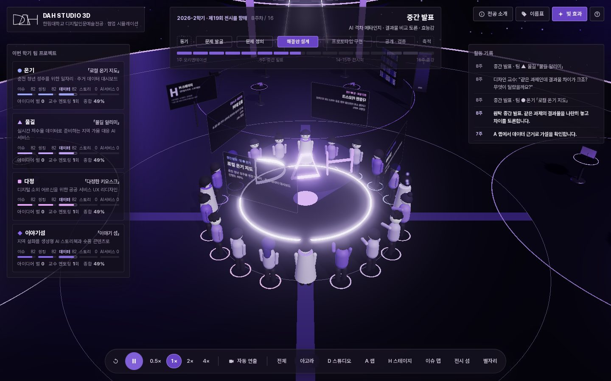
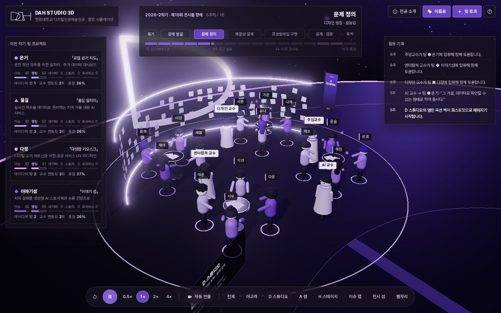
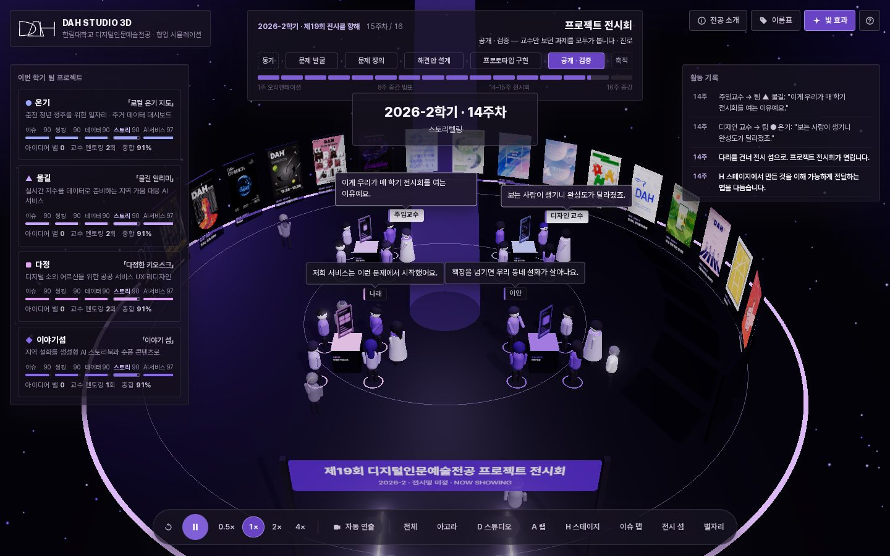
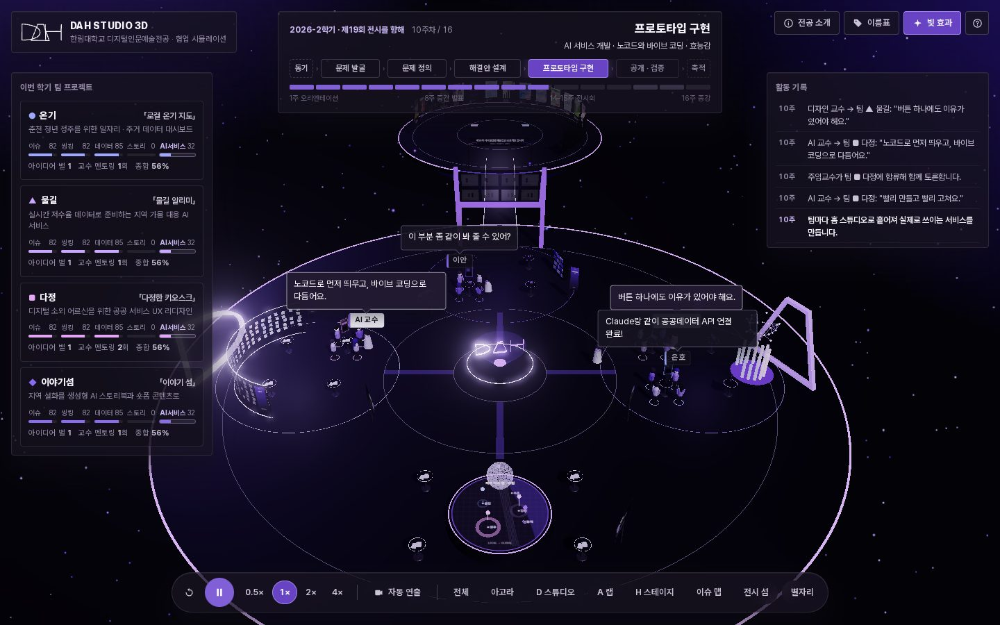
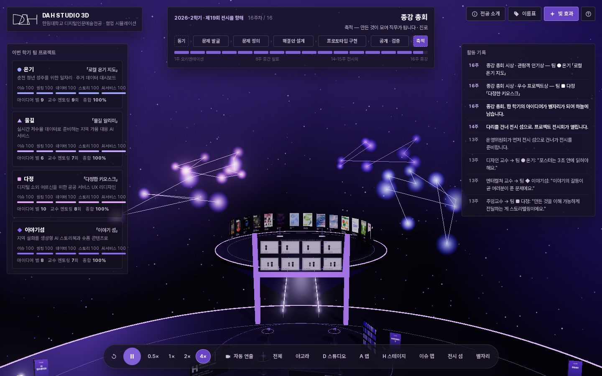

# DAH Studio 3D

한림대학교 **디지털인문예술전공(DAH)** 의 한 학기를 3D 공간에서 보여주는 협업 시뮬레이션입니다.
교수와 학생이 원탁에서 만나 토론하고, D · A · H 세 스튜디오를 오가며 함께 프로젝트를 만들어 **프로젝트 전시회**에 이르는 16주를 재생합니다. 대화에서 나온 좋은 아이디어는 별이 되어 원탁 위 하늘에 팀별 별자리로 쌓입니다.

> 사람을 향해 연결되는 지성 · 읽고, 다정하게 답하다



| D 스튜디오에서 문제 정의 | 전시 섬의 프로젝트 전시회 |
| --- | --- |
|  |  |
| **프로토타입 구현 (전체 보기)** | **종강 총회 · 아이디어 별자리** |
|  |  |

## 전공의 무엇을 공간으로 옮겼나

전공 웹사이트([dah-hallym.vercel.app](https://dah-hallym.vercel.app))의 내용을 바탕으로 설계했습니다.

| 전공 웹사이트의 내용 | 3D 공간 · 시뮬레이션에서 |
| --- | --- |
| CI: 로고 D·A·H 세 조각, "세 개의 형식, 하나의 응답" | 로고의 원본 패스로 세 스튜디오의 건축물을 세웠습니다. 원탁 위 홀로그램도 같은 도형입니다 |
| D: 열린 곡선 — 먼저 듣고 열어 두고 안으로 초대하는 구조 | **D 스튜디오**(디자인 트랙): 아고라 쪽으로 열린 곡선 유리벽에 팀별 포스트잇이 쌓입니다 |
| A: 상승하는 삼각 — 흩어진 데이터와 생각을 새로운 가능성으로 | **A 랩**(AI 트랙): 삼각 게이트 앞에서 막대 차트와 네트워크 그래프가 자랍니다 |
| H: 연결하는 기둥과 가로선 — 서로 다른 세계 사이에 다리를 놓는 대화 | **H 스테이지**(엔터컬쳐 트랙): H 게이트의 윗칸은 스토리보드, 아랫칸은 전시 섬으로 건너가는 다리입니다 |
| 프로젝트의 기반 다섯 역량 · 문제 발굴 → 문제 정의 → 해결안 설계 → 프로토타입 구현 → 공개·검증 | 16주 시나리오의 뼈대입니다. 팀 카드에서 다섯 역량이 단계별로 자랍니다 |
| 교육 설계: 동기 → 효능감 → 진로, 1주차 직군 지도, AI 격차 메타인지, Reverse Learning & Scaling Up | 오리엔테이션의 직군 지도 패널, 중간 발표의 결과물 비교 토론, 교수들의 대사 |
| 2017-2부터 매 학기 이어진 프로젝트 전시회 18회 | **전시 섬**의 나선형 포스터 벽(실제 포스터). 학기가 끝날 때마다 새 전시가 한 장씩 쌓입니다 |
| 동아리(더 인스튜디오, I-SO, CON:NECT, DS4H) · 운영위원회 LUCID | 스튜디오별 동아리 배너, 전시 준비에 먼저 나서는 운영위원회 학생 |
| 지역 문제 해결(동해 · 강릉 · 춘천 등) 중심의 학생 성과 | **이슈 맵**(강원 지역 지도)과 네 팀의 프로젝트 주제 |
| 융합전공 · 복수전공생 | 학생마다 주전공(사회학과, 경영학과, 국어국문학전공 …)이 다릅니다 |

## 한 학기의 흐름

| 주차 | 단계 | 장소 | 모습 |
| --- | --- | --- | --- |
| 1 | 오리엔테이션 | 원탁 | 주임교수가 네 갈래 직군 지도를 보여 주고, 학생들이 좋아하는 것을 이야기합니다 |
| 2 | 팀 빌딩 | 아고라 | 트랙이 다른 학생들이 섞여 네 팀을 만듭니다 |
| 3–4 | 문제 발굴 | 이슈 맵 | 지역과 글로벌 이슈 탐색 — 지도 위 핀이 올라옵니다 |
| 5–6 | 문제 정의 | D 스튜디오 | 디자인 씽킹 — 곡선 벽이 포스트잇으로 채워집니다 |
| 7 | 해결안 설계 | A 랩 | 데이터 분석 — 차트와 네트워크가 자랍니다 |
| 8 | 중간 발표 | 원탁 | 같은 과제의 결과물을 나란히 놓고 차이를 토론합니다 |
| 9–12 | 프로토타입 구현 | 팀별 홈 스튜디오 | AI 서비스 개발 — 팀 화면에 UI가 하나씩 채워집니다 |
| 13 | 스토리텔링 | H 스테이지 | 포스터 · 영상 · 웹사이트 — 스토리보드가 켜지고 운영위원회가 전시를 준비합니다 |
| 14–15 | 프로젝트 전시회 | 전시 섬 | 다리를 건너 전시가 열리고 관람객과 현업 멘토가 찾아옵니다 |
| 16 | 종강 총회 | 원탁 | 시상과 함께 한 학기의 아이디어가 별자리로 하늘에 남습니다 |

교수 네 명(주임교수 · 디자인 · AI · 엔터컬쳐)은 팀 사이를 돌며 멘토링하고, 교수가 합류한 팀은 대화가 더 자주 오가고 역량과 아이디어 별이 더 빨리 쌓입니다. 16주가 끝나면 다음 학기(제20회 전시를 향해)가 이어지고, 지난 학기의 별자리는 흐려진 채 하늘에 남습니다.

## 조작

- 드래그 회전 · 스크롤 확대 · 우클릭 드래그 이동
- 인물을 클릭하면 역할 · 주전공 · 팀 · 지금 하는 일 · 최근 대화를 볼 수 있고, **따라가기**로 카메라가 그 사람을 따라갑니다
- 전시 섬의 포스터를 클릭하면 역대 전시 정보를 볼 수 있습니다
- 하단 도크: 처음부터 · 재생/일시정지(Space) · 배속(0.5–4×) · 자동 연출 · 장소 바로가기
- 상단 주차 막대를 클릭하면 그 주로 바로 이동합니다
- 팀 카드를 클릭하면 그 팀으로 카메라가 이동합니다

## 실행

Node.js LTS가 필요합니다.

```bash
npm install
npm run dev       # 개발 서버 (http://localhost:5173)
npm run build     # dist/ 에 정적 파일 생성
npm run preview   # 빌드 결과 미리보기
```

`dist/`는 정적 파일이라 Vercel, GitHub Pages, 학교 웹서버 어디에나 올릴 수 있습니다. Vercel에서는 저장소를 가져오면 Vite 프로젝트로 자동 인식됩니다.

### 공유 링크 파라미터

수업이나 발표에서 특정 장면을 바로 열 때 씁니다.

| 파라미터 | 예 | 설명 |
| --- | --- | --- |
| `week` | `?week=14` | 그 주차에서 시작 (1–16) |
| `autostart` | `&autostart=1` | 소개 화면 없이 바로 시작 |
| `cam` | `&cam=gallery` | 카메라 위치: `overview` `agora` `D` `A` `H` `field` `gallery` `sky` |
| `speed` | `&speed=2` | 배속: `0.5` `1` `2` `4` |
| `names` | `&names=1` | 이름표 켜기 |
| `bloom` | `&bloom=0` | 빛 효과 끄기(저사양 기기) |
| `warm` | `&warm=10` | 시작 전에 그만큼(초) 미리 진행 |
| `paused` | `&paused=1` | 일시정지 상태로 시작 |

예: 프로젝트 전시회 장면 — `?week=14&autostart=1&cam=gallery&warm=10`

## 내용 바꾸기

코드를 몰라도 아래 세 파일만 고치면 됩니다.

- `src/data/dah.js` — 전공 정보(비전 · 미션 · 트랙 · 다섯 역량 · 전시회 아카이브). **이번 학기 전시명이 정해지면 `current.title`에 넣으세요.** 새 전시 포스터는 `public/posters/{학기}.webp`로 넣고 `exhibitions`에 한 줄 추가합니다.
- `src/data/cast.js` — 교수 · 학생 · 팀 · 프로젝트 주제와 팀별 대사
- `src/data/script.js` — 16주 단계 구성(주차 · 장소 · 카메라)과 단계별 대사

시간 속도, 공간 배치, 카메라 위치는 `src/config.js`에 있습니다.

## 구조

```text
index.html
src/
  main.js            렌더러 · 카메라 · 선택 · 자동 연출 · 진입점
  config.js          CI 색상 · 시간 · 공간 배치 · 카메라 프리셋
  camera.js          부드러운 카메라 이동과 따라가기
  data/              전공 정보 · 등장인물 · 16주 시나리오
  world/             우주 배경 · 섬 · 스튜디오 · 전시 섬 · 입자와 별자리
  agents/            인물 모델 · 걷기와 몸짓 · 길찾기 · 학기 진행(디렉터)
  ui/hud.js          타임라인 · 팀 카드 · 인스펙터 · 활동 기록 · 소개 화면
public/
  posters/           역대 프로젝트 전시회 포스터 18장
  ci/                DAH 로고 · 모티브
```

Three.js(WebGL), Vite, Pretendard로 만들었습니다. 색은 전공 CI의 보라 단일 계열(Deep Purple Black · Primary Purple · Light Purple …)만 씁니다.

## 출처와 참고

- 전공 소개 · 비전 · 트랙 · 다섯 역량 · 전시회 목록 · 동아리 · CI 문구와 로고, 전시 포스터는 전공 웹사이트 저장소(DAH-committee/dah-website)의 원문 데이터를 옮겼습니다.
- 교수는 실명 대신 역할로 부르고, 학생과 팀 프로젝트는 전공의 교육 방식을 보여주기 위한 **가상 인물 · 가상 설정**입니다. 종강 총회의 시상도 시뮬레이션 안의 가상 시상입니다.
